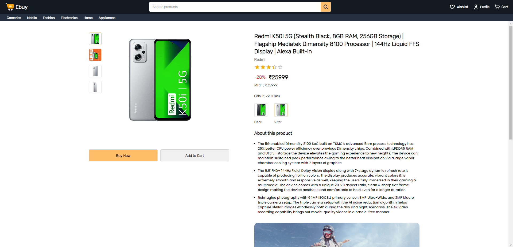
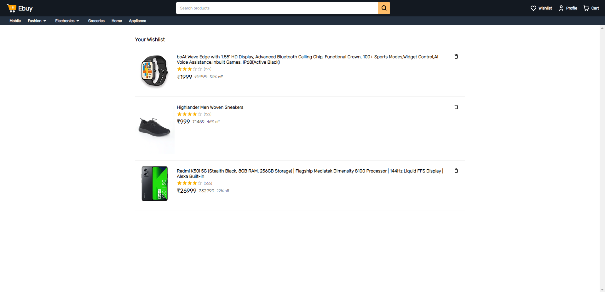

# Ebuy an ecommerce website made using MERN stack (on built)

This project is made with React, Node and Typescript.

## Prerequisites

Make sure you have installed all of the following prerequisites on your development machine:

- Git - [Download & Install Git](https://git-scm.com/downloads). OSX and Linux machines typically have this already installed.
- Node.js - [Download & Install Node.js](https://nodejs.org/en/download/) and the npm package manager. If you encounter any problems, you can also use this [GitHub Gist](https://gist.github.com/isaacs/579814) to install Node.js.

## Cloning The GitHub Repository

The recommended way to get Ebuy clone is to use git to directly clone the repository:

```bash
$ git clone https://github.com/nisabmohd/ebuy-mern.git
```

## Environment variables React setup

create .env file in client/

```
VITE_SERVER_URL=http://localhost:8000
```

## Environment variables Node setup

create .env in server/

```
PORT=8000
MONGO_URI=mongodb://0.0.0.0:27017/ebuy
JWT_SECRET={jwt secret}
JWT_REFRESH_SECRET={jwt refresh secret}
DEV=true
```

## Running Your Application

open terminal/bash in this repo and enter below commands to start the application

&#8594; To start the server

```bash
$ cd server
$ npm run dev
```

&#8594; To start the client app

```bash
$ cd client
$ npm run dev
```

- Your client application should run on port: 5137 with the _development_ environment configuration, so in your browser just go to [http://localhost:5173](http://localhost:5173)

- Your server application should run on port 8000, so in your browser just go to [http://localhost:8000](http://localhost:8000)

## Overview

  
  
  
